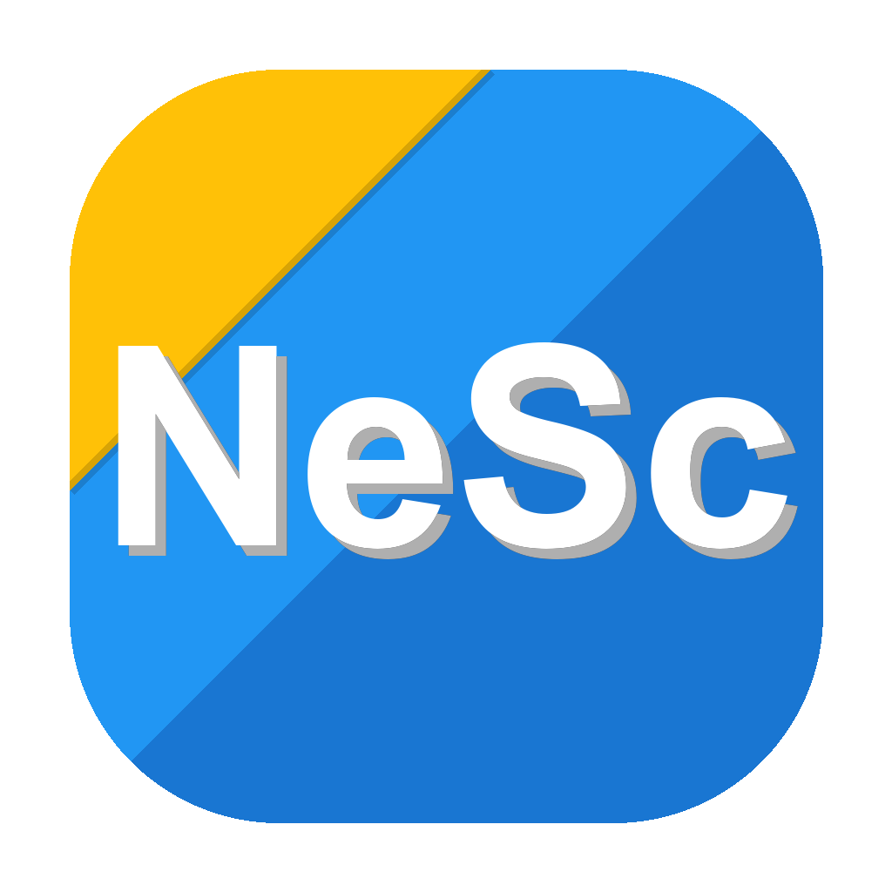

<p align="center">
  
</p>

# NexScore

<p align="center">
  <strong>A professional, high-performance cross-platform score tracker for your favorite card and board games.</strong><br>
  Available on <strong>Android</strong> · <strong>iOS</strong> · <strong><a href="https://faserf.github.io/NexScore/">Web (PWA)</a></strong>
</p>

<p align="center">
  <a href="https://github.com/FaserF/NexScore/actions?query=workflow%3Atest"></a>
  <a href="https://github.com/FaserF/NexScore/releases/latest"></a>
  <a href="LICENSE"></a>
</p>

---

## 🚀 Overview

NexScore is built with a focus on **Efficiency, Clarity, and Robustness**. It's not just a score tracker; it's a premium gaming companion designed with a "Backend Profi" philosophy—standardized architecture, high-performance logic, and a stunning glassmorphism UI.

### Key Highlights
- **Clean Architecture**: Decoupled game logic using Riverpod Notifiers for reactive, predictable state management.
- **Profi Backend**: Unified `Result<T>` error handling, structured `AppLogger`, and optimized SQLite with database indexes.
- **Advanced CI/CD**: Fully automated semver versioning (`Stable`, `Beta`, `Dev`) for Android, iOS, Docker, and PWA.
- **18+ Content**: Dedicated support for drinking games like **SipDeck** with safety warnings and age-restricted content notices.

---

## 🎮 Supported Games

NexScore supports a wide variety of card, dice, and strategy games with specialized logic for each:

- **Wizard®**: Comprehensive trick bidding with multiple scoring variants (Standard/Lenient/Extreme).
- **Qwixx®**: Digital scoresheet with locked-row logic and automated penalty calculation.
- **Schafkopf**: Bavarian trick-taking with Sauspiel, Solo, and Wenz support.
- **Kniffel®**: Full Yahtzee scoresheet with automated upper-section bonus calculation.
- **Phase 10®**: Original, Masters, and Duel variants with phase tracking.
- **Darts X01**: Fast-pass scoring board for 301/501/701/1001 with bust detection.
- **Rommé**: Multi-round penalty tracking for 2–6 players.
- **Arschloch / President**: Rank tracking with automated card exchange instructions. Supports 2–8 players.
- **SipDeck (18+)**: Dynamic drinking game with 50+ challenges and automated sip tracking.
- **BuzzTap (18+)**: High-energy, fast-paced tapping party game with automated sip tracking.
- **WayQuest**: Entertaining questions and road challenges for long car rides.

---

## 🛠️ Tech Stack & Architecture

- **Framework**: [Flutter 3.x](https://flutter.dev) (Multi-platform WASM, Mobile)
- **State Management**: [Riverpod](https://riverpod.dev) (AsyncNotifiers, Providers)
- **Storage**: [sqflite](https://pub.dev/packages/sqflite) (Offline-first, performance indexed)
- **Cloud**: [Firebase](https://firebase.google.com) (Auth, Firestore Sync)
- **Design System**: Glassmorphism with Material 3 & [FlexColorScheme](https://pub.dev/packages/flex_color_scheme)
- **CI/CD Orchestration**: Automated with Python semantic versioning and GitHub Actions

For deep technical details, see our **[Documentation Guide](docs/README.md)**.

---

## 📦 Deployment & Releases

### Release Channels
We maintain three release streams:
- **Stable**: For general use.
- **Beta**: Feature-complete previews of the next release.
- **Dev**: Bleeding-edge builds directly from the `main` branch.

### Manual Build (Local)
```bash
# Web (Docker)
docker build -t nexscore-web .
docker run -p 8080:80 nexscore-web

# Android
flutter build apk --release --dart-define=APP_VERSION=1.0.0

# iOS (Unsigned)
flutter build ipa --no-codesign --release
```

---

## 🤝 Contributing

We follow a high-standard "Clean Code" policy.
1. [Report a Bug](https://github.com/FaserF/NexScore/issues/new?template=bug_report.yml)
2. [Request a Feature](https://github.com/FaserF/NexScore/issues/new?template=feature_request.yml)
3. Check the **[Developer Guide](docs/README.md#contributing)** before submitting PRs.

---

## 📜 Legal & Attribution

**Created by [FaserF](https://fabiseitz.de)**

*NexScore is an independent project and is not affiliated with, authorized, or endorsed by the official publishers of Wizard®, Qwixx®, Kniffel®, or Phase 10® or any other mentioned game in here. All trademarks are property of their respective owners.*

Licensed under [MIT](LICENSE).
