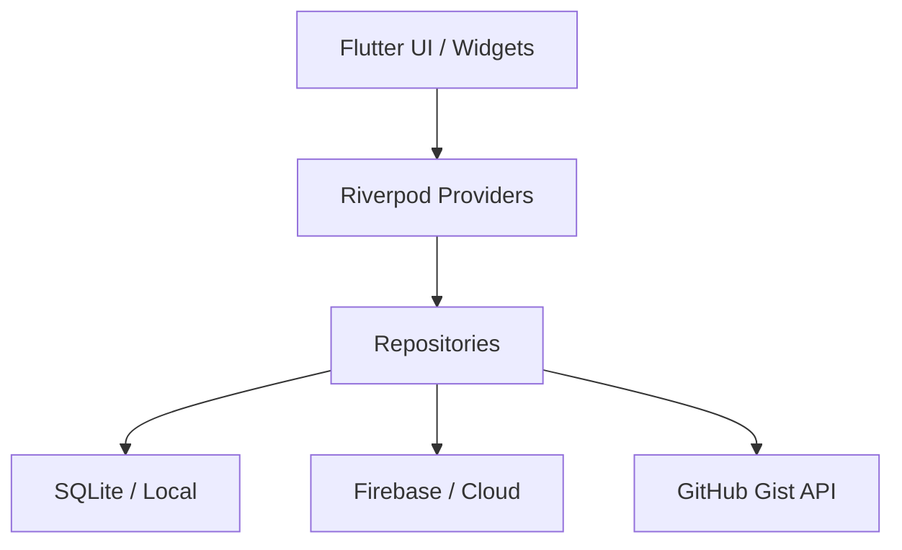

# System Architecture 🏛️

NexScore follows a clean, modular architecture influenced by **Domain-Driven Design (DDD)** and **Clean Architecture** principles, adapted for Flutter's reactive nature.

## Layered Structure

The project is organized by **Features**, with each feature typically containing the following layers:

### 1. Core Layer (`lib/core/`)
- Contains cross-cutting concerns like UI themes, constants, utilities, and common models.
- **Localization**: Centralized `AppLocalizations` for multi-language support.
- **Error Handling**: Standardized `Failure` and `Result` types.

### 2. Feature Layer (`lib/features/`)
Each feature (e.g., `wizard`, `history`, `players`) is self-contained:

- **Presentation**: Flutter widgets, screens, and Riverpod providers for UI state.
- **Repository**: Interfaces and implementations for data access (Local SQL + Cloud Sync).
- **Models**: Data classes specific to the feature.

## Data Flow 🔄

1. **State Management**: We use **Riverpod** for global and local state. Providers watch the repositories and expose state (often `AsyncValue`) to the UI.
2. **Persistence**: The `SessionRepository` and `PlayerRepository` interact with `database_service.dart`.
3. **Reactivity**: When a game session is saved, the `sessionsProvider` is automatically invalidated, causing the History and Leaderboard screens to refresh immediately.

## Navigation 🗺️

NexScore uses **GoRouter** with a `StatefulShellRoute`. This allows:
- **Persistent Bottom Navbar**: The navbar stays in place while navigating between main tabs.
- **Nested Braching**: Each tab maintains its own navigation stack.
- **Deep Linking**: Routes like `/app/profile/settings` work naturally.

---

## Component Diagram (High Level)

