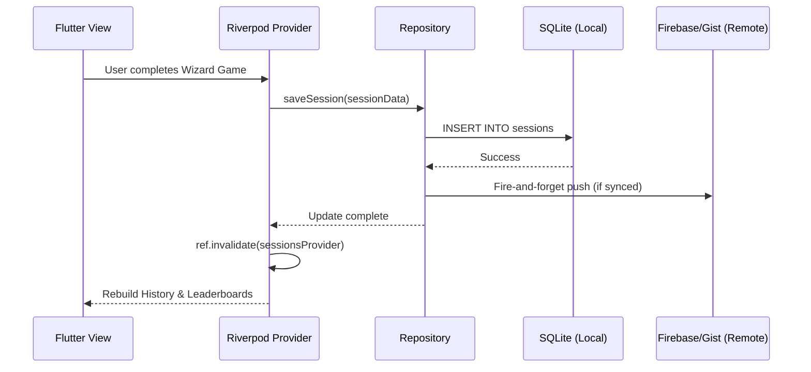

# System Architecture 🏛️

NexScore is built on a robust, offline-first architecture designed to provide a seamless user experience whether the device is connected to the internet or not. This document details the structural decisions, data flow, and core architectural patterns used throughout the application.

## Core Architectural Patterns

NexScore employs a variation of **Clean Architecture** combined with **Feature-First Organization**. This ensures that the codebase scales horizontally as new games and features are added, without creating a tangled dependency web.

### 1. Feature-First Directory Structure

Instead of grouping files by type (e.g., all models together, all views together), NexScore groups files by *business feature*.

```
lib/
├── core/                  # Cross-cutting concerns
│   ├── error/             # Standardized Failure classes
│   ├── i18n/              # Localization setup
│   ├── storage/           # Database setup and migrations
│   ├── sync/              # Cloud synchronization logic
│   ├── theme/             # Neumorphic/Glassmorphic widgets
│   └── utils/             # Helpers (e.g., logger)
├── features/
│   ├── auth/              # Authentication flows and profile
│   ├── games/             # Game selection and specific game UIs (Wizard, Qwixx, etc.)
│   ├── history/           # Completed session views
│   ├── leaderboards/      # Global and per-game player rankings
│   └── players/           # Player management (CRUD)
```

Each feature folder is self-contained. For example, `lib/features/players/` contains its own `presentation/` (UI widgets), `domain/` (Models), and `data/` (Repositories) if necessary.

### 2. State Management with Riverpod

[Riverpod](https://riverpod.dev/) is the backbone of NexScore's state management and dependency injection.

- **Global State**: Providers like `databaseProvider`, `authProvider`, and `syncProvider` hold global singleton instances of services.
- **Async Data Fetching**: We extensively use `FutureProvider` and `StreamProvider` to fetch data from the local SQLite database. The UI consumes these via `AsyncValue` to seamlessly handle loading, error, and data states.
- **Reactivity Driven by Invalidation**: When a user saves a new game session, the `sessionRepository` invalidates the `sessionsProvider`. This declarative approach forces any UI dependent on `sessionsProvider` (like the History Screen or Leaderboards) to automatically refresh.

## Data Layer & Persistence

NexScore is an **Offline-First** application. All reads and immediate writes hit a local SQLite database first.

### Local Storage (`database_service.dart`)
- **Mobile/Desktop**: Uses `sqflite` to manage a native SQLite database.
- **Web (PWA)**: Uses `sqflite_common_ffi_web` to persist a SQLite database within the browser's IndexedDB. This was a critical architectural choice to ensure PWA users don't lose their data on page reloads.

### Database Schema

The SQLite database consists of three primary tables (schema version 3):

1. **`players`**: Stores player profiles.
   - `id TEXT PRIMARY KEY`: Universally unique identifier.
   - `name TEXT NOT NULL`: Display name.
   - `avatarColor TEXT NOT NULL`: Hex color or theme name for UI avatars.
   - `emoji TEXT`: Optional avatar emoji icon (added in v2).
   - `ownerUid TEXT`: Firebase user ID for synchronization ownership.
   - `isDeleted INTEGER NOT NULL DEFAULT 0`: Soft deletion flag (0 for active, 1 for deleted).
   - *Index*: `idx_players_is_deleted` on the `isDeleted` column to optimize filtering active players.

2. **`sessions`**: Stores completed and active game sessions.
   - `id TEXT PRIMARY KEY`: Unique session ID.
   - `gameType TEXT NOT NULL`: Name/type of the game (e.g., Wizard, Qwixx, Volleyball, Sudoku).
   - `startTime TEXT NOT NULL`: ISO 8601 string of the start time.
   - `endTime TEXT`: ISO 8601 string of the end time.
   - `durationSeconds INTEGER NOT NULL DEFAULT 0`: Played duration.
   - `players TEXT NOT NULL`: JSON-serialized list of player IDs participating in the session.
   - `scores TEXT NOT NULL`: JSON-serialized map of `playerId` to their final score.
   - `gameData TEXT NOT NULL`: Game-specific JSON structure containing scores per round, dice roles, cards dealt, or board states.
   - `ownerUid TEXT`: Firebase owner ID for synchronization ownership.
   - `completed INTEGER NOT NULL DEFAULT 0`: Flags whether the game session is finished (1) or in-progress (0).
   - *Index*: `idx_sessions_start_time` on the `startTime` column to optimize historical list fetches.

3. **`player_groups`**: Stores pre-configured squads/groups of players for faster game creation (added in v3).
   - `id TEXT PRIMARY KEY`: Group identifier.
   - `name TEXT NOT NULL`: Custom group name.
   - `playerIds TEXT NOT NULL`: JSON-serialized list of player IDs belonging to this group.

### Schema Migrations

The database migration logic resides in `DatabaseService._onUpgrade` and handles the following schema upgrades:
- **v1 to v2**: Adds the `emoji` column to the `players` table dynamically.
- **v2 to v3**: Creates the `player_groups` table to support preset player squads.

## Synchronization Engine

To allow users to access their data across devices, NexScore implements a robust sync engine.

### Firebase Sync (Google Sign-In)
When a user authenticates via Google:
1. Local changes are written to SQLite.
2. A background task attempts to push these changes to Firebase Cloud Firestore, keyed by the user's `ownerUid`.
3. The app listens to Firestore snapshots to pull down changes made on other devices.

### GitHub Gist Backup (GitHub Sign-In)
For privacy-conscious or power users, NexScore offers a "Bring Your Own Storage" model via GitHub Gists.
1. The app requests the `gist` OAuth scope during sign-in.
2. The user initiates a backup manually via the Profile screen.
3. The `GistSyncService` serializes the entire local SQLite database (players and sessions) into a single JSON file.
4. It creates or updates a private Gist named `nexscore_backup.json` using the GitHub REST API.
5. Restoration works in reverse, overwriting the local SQLite database with the JSON payload.

## Navigation & Deep Linking

NexScore uses `GoRouter` for declarative routing.

- **Stateful Navigation**: The main app uses a `StatefulShellRoute`. This preserves the exact state and scroll position of the Leaderboard tab even if the user switches to the Players tab and back.
- **Deep Linking Ready**: The structured path definitions (e.g., `/settings`, `/games/setup/wizard`) ensure the app can easily support web deep links or universal links in the future.

## High-Level Component Interaction Diagram



## Error Handling Philosophy

All repository and service level operations return a `Result<T>` wrapper (a custom implementation akin to Rust's Result type). This forces the UI layer to explicitly handle both the `Success(data)` and `Failure(error)` cases, preventing unhandled exceptions from crashing the app and ensuring the user always receives helpful visual feedback (e.g., Snackbars) when an operation fails.
